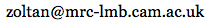

# neuronanalyser
An analysis toolkit for tracking blobs and extracting intensity values from imaging data, designed for use with ratiometric fluorescent sensors.

### Source code
The [source code is available](https://github.com/neuronanalyser/neuronanalyser/tree/master/source), which can be used to run the program within MATLAB under various platforms, including Windows and Mac OS X.

### Stability
This is a development version. A more stable version with refactored code is expected in a few weeks.

### Contact
For any questions about the use or reuse of the program, please contact 
